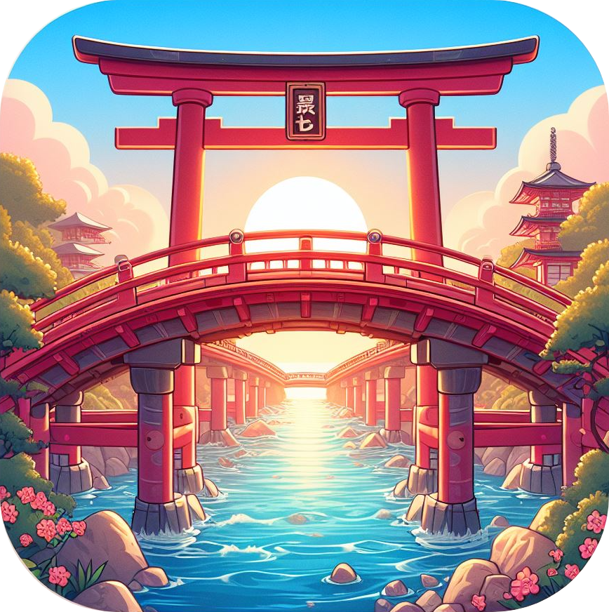

# Hey there, language adventurers! 👋

I'm the solo dev behind **NihongoBridge** - your friendly neighborhood app for swapping English and Japanese words like they're Pokémon cards.

## What's the Deal?

Imagine a bridge, right? On one end, you've got English, and on the other, Japanese. NihongoBridge is that cool hangout spot in the middle where you can chill and learn both languages at your own pace.

## It's All About Sharing

This app is totally **free** and **open source**. That's right, no price tag, no hidden fees. Just pure language-learning goodness. And hey, if you're into coding and have some rad ideas or just wanna lend a hand, hit me up! The more, the merrier.

## Keepin' It Real

Remember, crossing the bridge is just half the fun. Don't forget to head back to your side every now and then. Languages are like muscles - if you don't flex 'em, you lose 'em!

So, whatcha waiting for? Let's build this bridge together and make language learning a blast!

  

